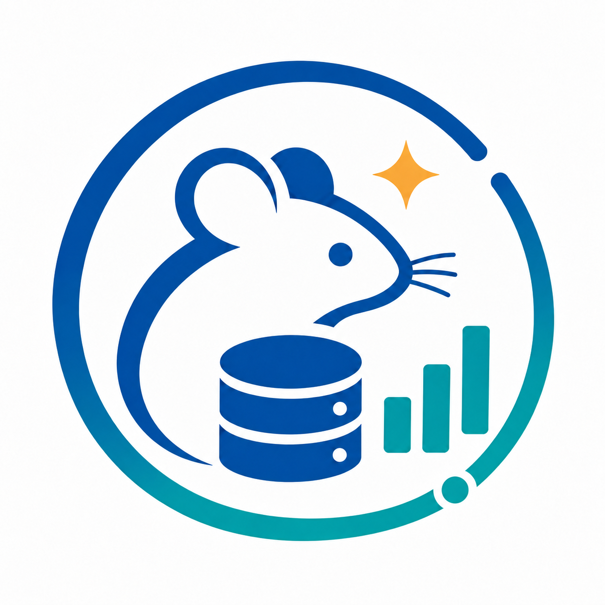

# MuriArc

> English | [简体中文](README_cn.md)

<div align="center">
  

  **Animal-first management · Research data with explicit relationships · Controlled AI assistance**
</div>

## Product positioning

MuriArc is an animal lifecycle, breeding, experiment-data, and AI-service management platform for research settings. It connects cages, animals, pedigrees, breeding facts, experiments, observations, measurements, samples, attachments, Audit, and Provenance through explicit domain relationships instead of unconstrained tables or raw SQL.

MuriArc is independently developed and maintained by `jarxunlai`, with AI-assisted engineering implementation. AI is not a legal author or copyright holder.

## Release status

> [!IMPORTANT]
> The repository is currently **`0.1.0 / preview_epoch_0`**. It is preparing the **`1.0.0 / E0001`** release candidate, but no official 1.0 RC has passed yet. Preview builds, source checkouts, local test services, and unsigned tester packages are not production releases.

The permanent compatibility promise begins with a verified `1.0.0 / E0001` artifact set. The same signed artifact digests must pass the complete private RC matrix before they may be published unchanged as `v1.0.0`.

## Core capabilities

The following capabilities are implemented and covered by current source or acceptance tests:

- **Animal registry and lifecycle**: animals, cages, transfers, lifecycle events, project assignments, attachments, Audit, and Provenance.
- **Breeding and genetics**: breeding lines, colonies, one-male/multi-female pairs, mating events, litters, animal drafts, pedigrees, structured genotype definitions, genotyping records, and evidence-backed genotyping batches.
- **Experiments and research records**: versioned experiment templates, cohorts, participation, enrollment genotype snapshots, procedures, observations, measurements, samples, and typed observation-value history.
- **Data operations**: bounded animal and measurement import, scoped Animal Registry export, attachment integrity checks, and verifiable business snapshots.
- **Multi-provider AI**: versioned user-owned model profiles for OpenAI Chat Completions, OpenAI Responses, Anthropic Messages, and explicitly configured compatible endpoints; controlled tools, approvals, citations, multimodal routing, and private image candidates.
- **Operations and governance**: Server accounts and roles, Environment Root recovery authority, technical-log retention, signed-upgrade control-plane contracts, and dual SQLite/PostgreSQL Store contracts.

A snapshot is not yet a general restore format. Ordinary import/export is not a Desktop-to-Server migration mechanism. macOS delivery, public production hosting, and a formally passed 1.0 RC are not currently claimed as complete.

## Desktop and Server editions

| Edition | Runtime | Intended use | Security and storage boundary |
| --- | --- | --- | --- |
| **Desktop** | Tauri v2 + Vue + SQLite | A researcher on one trusted Windows account | Native WebView window, local data root, attachment store, OS keyring for API keys; the passwordless local entry is operator confirmation, not an OS security boundary |
| **Server** | Axum + Vue + PostgreSQL | Multiple users and projects within one laboratory | Argon2id credentials, HttpOnly session, CSRF, revocable scoped tokens, per-user encrypted Provider secrets, loopback-first deployment |

Desktop is not delivered through VNC/noVNC or a browser desktop. Server is not a replacement for Desktop's local SQLite mode.

## AI safety boundary

- Provider credentials and model settings are isolated per user and profile version. Server secrets are encrypted; Desktop secret material is referenced through the OS keyring.
- Missing credentials, invalid profile ownership, archived profiles, stale defaults, or legacy read-only conversations fail before a Provider request.
- The model cannot execute raw SQL or bypass project scope, permissions, revision checks, previews, approvals, or researcher signatures.
- Ordinary writes are reviewable drafts. Sensitive actions—including animal transfer/death, deletion, bulk import, permissions, accounts, research signing, and image-evidence approval—remain human actions.
- Provider request/response errors, Audit, logs, and UI state must not contain API keys, passwords, Session, CSRF, Tokens, or private signing material.

See [Security](docs/SECURITY.md) for the complete trust model.

## Quick start

### Prerequisites

- Rust `1.88`
- Node.js `>=22.13`
- pnpm `11.5.0` through Corepack
- PostgreSQL `17` for Server integration tests and deployments
- Windows WebView2 and the Tauri build prerequisites for Desktop work

### Developer verification

```bash
[ -f "$HOME/.cargo/env" ] && . "$HOME/.cargo/env"
corepack enable
corepack prepare pnpm@11.5.0 --activate
pnpm --dir ui install --frozen-lockfile

cargo fmt --all -- --check
cargo clippy --locked -p muriarc-core -p muriarc-server --all-targets --all-features -- -D warnings
cargo test --locked -p muriarc-core -p muriarc-server --all-targets --all-features
pnpm --dir ui run test
pnpm --dir ui run typecheck
VITE_MURIARC_GATEWAY=remote pnpm --dir ui run build
```

PostgreSQL Store tests require an isolated PostgreSQL 17 instance through `MURIARC_TEST_DATABASE_URL`; a skipped database suite is not a pass. Each worktree must use its own UI dependencies and runtime data. See [Environments](docs/ENVIRONMENTS.md).

### Preview deployment

The root Compose file and source commands are for development and preview validation only. Copy the example environment file, replace every placeholder, keep PostgreSQL private, and terminate TLS at a trusted reverse proxy. Do not treat a source-built Compose stack as a signed 1.0 deliverable.

```bash
cp .env.example .env
# Edit .env locally. Never commit it or paste secrets into an issue.
docker compose config --quiet
docker compose up -d --build --wait
```

Follow [Server deployment](docs/DEPLOYMENT.md), [Desktop delivery](docs/DESKTOP_DELIVERY.md), and [Server delivery](docs/SERVER_DELIVERY.md) before using any non-development environment.

## Data and privacy

- Git tracks source code, migrations, tests, small synthetic fixtures, documentation, dependency locks, and public release definitions.
- Git does not track runtime databases, attachments, snapshots, recovery copies, credentials, AI keys, sessions, tokens, private keys, or real animal/research data.
- Database, attachments, data artifacts, deployment configuration, generation manifest, key material, and AI state form one recovery set and must be backed up and restored together.
- Existing data is upgraded in place only through a verified, recoverable workflow. Never clear a database or hand-edit migration SQL to make an upgrade pass.
- Standard acceptance data is synthetic. Real research data must use an owner-approved privacy, backup, and access-control policy.

## Documentation

Start at the [documentation index](docs/README.md). Primary public documents include:

- [Architecture](docs/ARCHITECTURE.md) and [Security](docs/SECURITY.md)
- [Environments](docs/ENVIRONMENTS.md) and [Server deployment](docs/DEPLOYMENT.md)
- [Desktop delivery](docs/DESKTOP_DELIVERY.md) and [Server delivery](docs/SERVER_DELIVERY.md)
- [MuriArc data migration](docs/MIGRATION.md), [Upgrade Engine](docs/UPGRADE_ENGINE.md), and [compatibility contract](docs/UPGRADE_COMPATIBILITY.md)
- [Cloudflare Public Profile](docs/CLOUDFLARE_PUBLIC_PROFILE.md) and [delivery acceptance](docs/DELIVERY_ACCEPTANCE.md)

## Development and contribution

Read [CONTRIBUTING.md](CONTRIBUTING.md) and the relevant architecture/security document before changing public behavior. Keep transport entrypoints thin, place business rules in Application/Core, maintain SQLite/PostgreSQL contract parity, and add tests for every public behavior change.

Feature and bug-fix development should use a clean non-main worktree. Do not commit generated builds, `node_modules`, Cargo targets, databases, secrets, or local acceptance evidence.

## License

Copyright 2026 `jarxunlai`.

MuriArc is licensed under the [Apache License 2.0](LICENSE). See [NOTICE](NOTICE) for the project notice.
